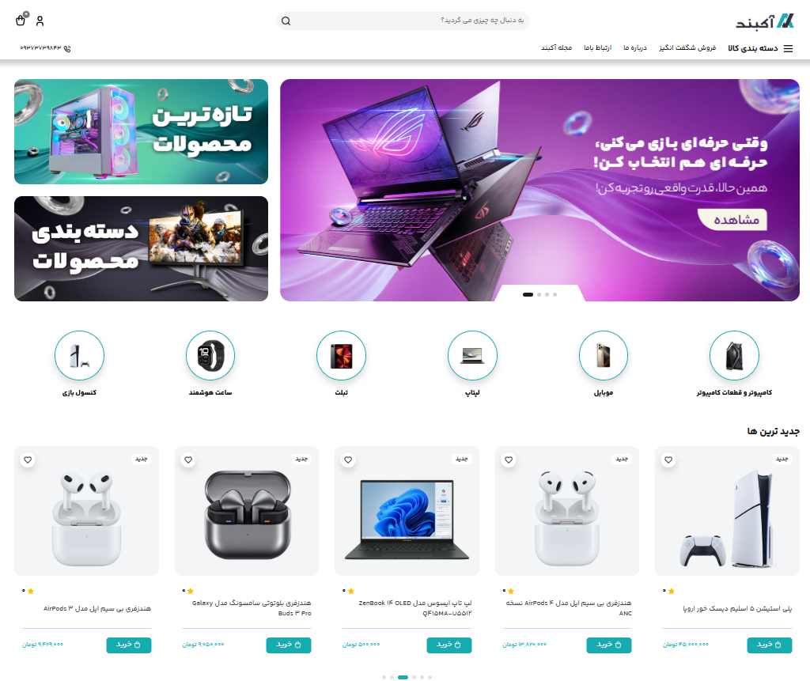
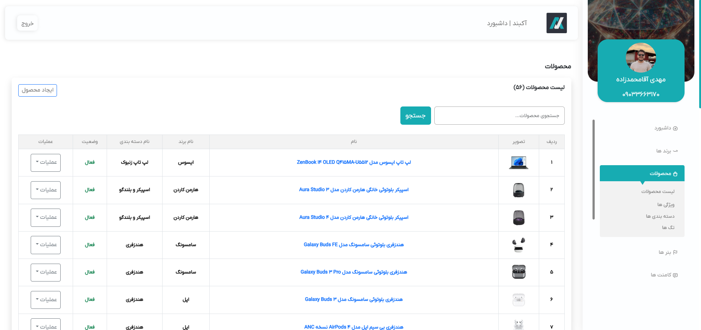
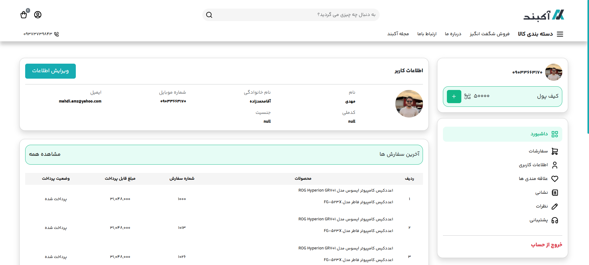
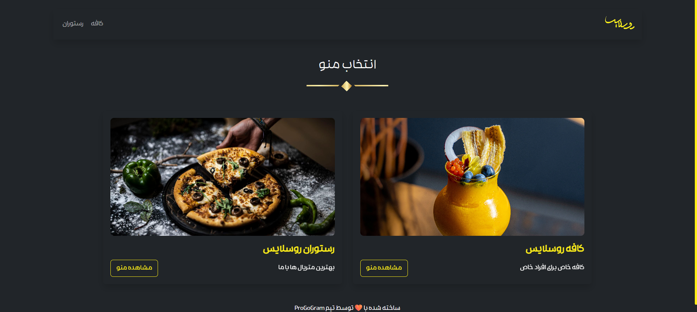
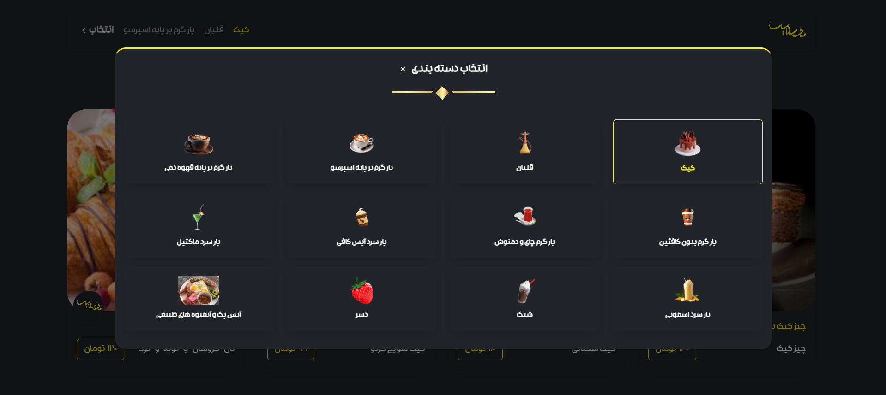
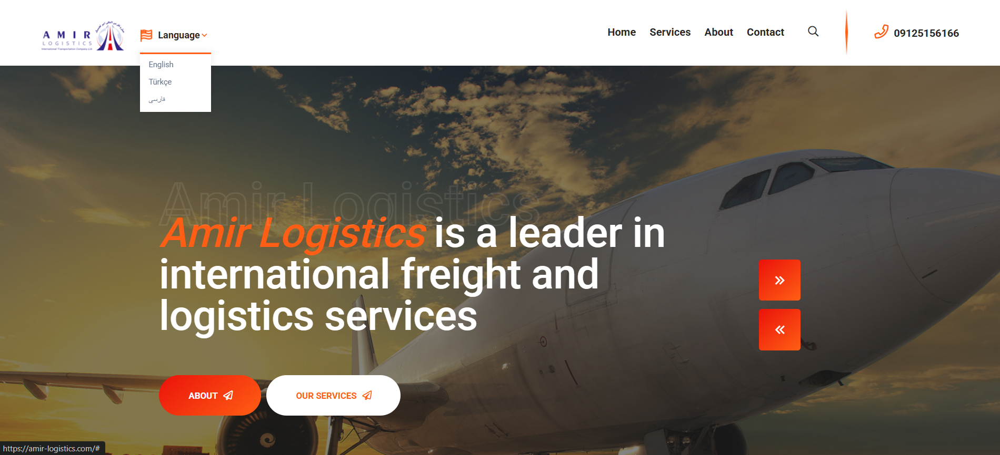

# 🚀 Mahdi Projects Showcase

سلام 👋  
من **مهدی آقامحمدزاده** هستم — توسعه‌دهنده‌ی بک‌اند با تمرکز روی **Laravel**, **Node.js** و معماری‌های مقیاس‌پذیر.  
توی این ریپو خلاصه‌ای از چند پروژه‌ی واقعی که برای کسب‌وکارهای مختلف پیاده‌سازی کردم رو می‌بینی؛  
پروژه‌هایی که باعث افزایش فروش، کاهش هزینه‌ها، و ساده‌تر شدن فرایندهای کاری شدن.

---

## 🛒 پروژه: فروشگاه آنلاین آکبند

> **نوع پروژه:** فروشگاه اینترنتی  
> **هدف:** کاهش تماس تلفنی، افزایش فروش آنلاین و ساده‌سازی مدیریت سفارش‌ها  
> **تکنولوژی‌ها:** PHP · Laravel · MySQL · Redis · Nginx · Ubuntu

---

### 📦 خلاصه  
سیستم فروشگاهی کامل با ثبت‌نام کاربر، سبد خرید، پرداخت آنلاین، کیف پول و پنل ادمین داینامیک.

### ⚙️ قابلیت‌ها  
- ثبت‌نام / ورود کاربران  
- مدیریت محصولات، سفارش‌ها و کاربران  
- سبد خرید و درگاه پرداخت آنلاین  
- سیستم کیف پول و تراکنش‌ها  
- تخفیف مبلغی و درصدی  
- لیست علاقه‌مندی‌ها و مقایسه محصولات  
- امتیازدهی و ثبت نظر  
- فیلتر پیشرفته محصولات  
- ثبت آدرس و نمایش سفارش‌ها در پروفایل کاربر  
- پنل ادمین داینامیک برای بنرها، فرم تماس با ما و نقشه  

### 📸 تصاویر  
| صفحه | پیش‌نمایش |
|-------|-------------|
| صفحه اصلی |  |
| پنل ادمین |  |
| پنل کاربر |  |

### 💰 نتیجه  
- کاهش ۹۰٪ زمان پاسخ‌گویی به سفارش‌ها  
- فعال‌سازی فروش ۲۴ ساعته در سراسر کشور  
- افزایش رضایت مشتریان با پرداخت سریع و پیگیری سفارش آنلاین  

**🔗 لینک پروژه:** [akband.com](https://akband.com)  
**📬 تماس:** [@Cx001](https://t.me/Cx001) | [mahdiamz8212@gmail.com](mailto:mahdiamz8212@gmail.com)   

---

## ☕ پروژه: منوی آنلاین کافه (روسلایس و رز‌لند)

> **نوع پروژه:** منوی دیجیتال برای کافه‌ها  
> **هدف:** حذف منوی کاغذی، کاهش تماس تلفنی و افزایش سرعت سفارش‌گیری  
> **تکنولوژی‌ها:** PHP · Laravel · MySQL · Nginx · Ubuntu

---

### 📦 خلاصه  
منوی آنلاین برای کافه‌ها که مشتری با اسکن QR کد بتونه منو رو ببینه، سفارش بده و پرداخت کنه.  
این سیستم برای چند کافه از جمله **عمارت سران** و **کافه گل رزلند** پیاده‌سازی شد و هر کافه نسخه‌ی اختصاصی خودش رو دریافت کرد.

### ⚙️ قابلیت‌ها  
- مشاهده منو با اسکن QR Code  
- سفارش با شماره تلفن  
- پنل مدیریت اختصاصی برای آیتم‌ها  
- API اختصاصی برای وب‌اپلیکیشن  

### 📸 تصاویر  
| صفحه | پیش‌نمایش |
|-------|-------------|
| صفحه اصلی |  |
| صفحه منو |  |

### 💰 نتیجه  
- حذف کامل نیاز به منوی چاپی  
- افزایش سرعت سفارش تا ۳ برابر  
- کاهش تماس‌های تلفنی برای ثبت سفارش  

**🔗 لینک پروژه‌ها:**  
- [ruslice.co](https://ruslice.co)  
- [caferoseland.ir](https://caferoseland.ir)  

**📬 تماس:** [@Cx001](https://t.me/Cx001) | [mahdiamz8212@gmail.com](mailto:mahdiamz8212@gmail.com)   

---

## 🚚 پروژه: سایت معرفی شرکت حمل‌ونقل بین‌المللی امیر لجستیک

> **نوع پروژه:** وب‌سایت شرکتی  
> **هدف:** معرفی خدمات حمل‌ونقل بین‌المللی و جذب مشتریان خارجی  
> **تکنولوژی‌ها:** PHP · Laravel · MySQL · Nginx · Ubuntu

---

### 📦 خلاصه  
وب‌سایت رسمی شرکت حمل‌ونقل بین‌المللی امیر لجستیک برای معرفی خدمات، ثبت سفارش و پیگیری وضعیت بار.

### ⚙️ قابلیت‌ها  
- فرم ثبت سفارش با جزئیات بار  
- پنل مدیریت برای تخصیص راننده  
- سیستم پیگیری سفارش برای مشتریان  
- پروفایل راننده و وضعیت حمل  

### 📸 تصاویر  
| صفحه | پیش‌نمایش |
|-------|-------------|
| صفحه اصلی |  |

### 💰 نتیجه  
- افزایش اعتماد مشتریان و برندینگ بین‌المللی  
- افزایش نرخ تبدیل بازدیدکننده به مشتری  

**🔗 لینک پروژه:** [amir-logistics.com](https://amir-logistics.com)  
**📬 تماس:** [@Cx001](https://t.me/Cx001) | [mahdiamz8212@gmail.com](mailto:mahdiamz8212@gmail.com)   

---

## 💼 درباره من

👨‍💻 **نام:** مهدی آقامحمدزاده  
📍 **نقش:** Back-End Developer  
🧰 **مهارت‌ها:** Laravel · Node.js · Express · MySQL · MongoDB · Nginx · DevOps  
🔗 **LinkedIn:** [linkedin.com/in/mahdi-aghamohammadzadeh](https://linkedin.com/in/mahdi-aghamohammadzadeh)  
💻 **GitHub:** [github.com/ismahdi](https://github.com/ismahdi)

---

> اگر دنبال توسعه‌دهنده‌ای هستید که پروژه‌تون فقط “اجرا” نشه بلکه **نتیجه بده** —  
> من آماده‌ام همکاری کنیم.  
📩 تماس: **Telegram:** [@Cx001](https://t.me/Cx001) | **Email:** [mahdiamz8212@gmail.com](mailto:mahdiamz8212@gmail.com) 
